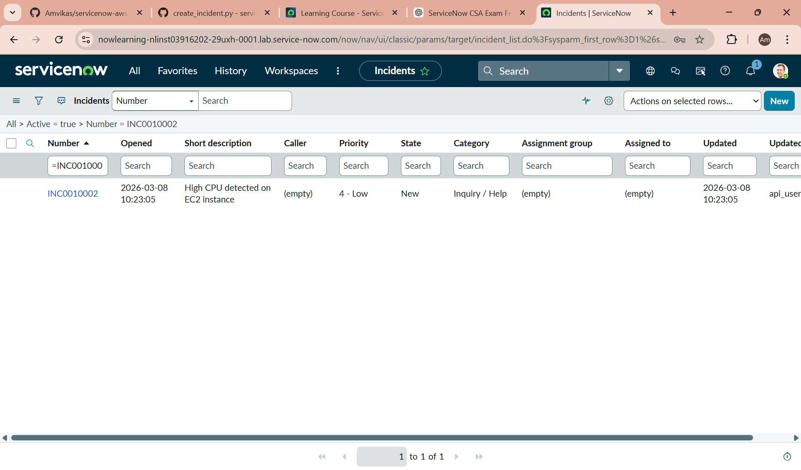

**ServiceNow AWS Self-Healing Platform**

# Overview
This project demonstrates a cloud incident self-healing system integrating ServiceNow ITSM with AWS monitoring.
When an AWS CloudWatch alarm detects infrastructure issues, Then there will be an automated workflow creates an incident in ServiceNow and attempts to give automated remediation.

# Technologies
ServiceNow
AWS EC2
AWS CloudWatch
AWS Lambda
Python
REST APIs

# Architecture Diagram
This project implements a **self-healing cloud infrastructure** by integrating AWS monitoring with ServiceNow incident automation.


# System Workflow
1. EC2 instance runs the application workload.
2. CloudWatch monitors CPU utilization.
3. If CPU usage exceeds the threshold, an alarm is triggered.
4. AWS Lambda invokes the ServiceNow REST API.
5. ServiceNow automatically creates an incident.
6. Flow Designer triggers automation.
7. The EC2 instance is restarted automatically.


# Features
Automatic incident creation
Cloud monitoring integration
Auto-remediation engine
ServiceNow incident updates

# Python Integration Test

A Python script was used to create incidents automatically using the ServiceNow Table API.

Example execution:

```bash
python servicenow/create_incident.py
```
Result:
```
Status: 201
Incident: INC0010002
```

This confirms that the ServiceNow REST API integration is working.

# Screenshots



